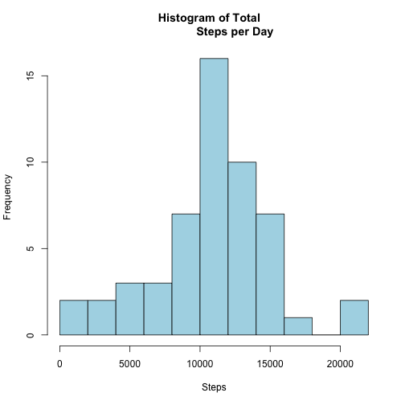
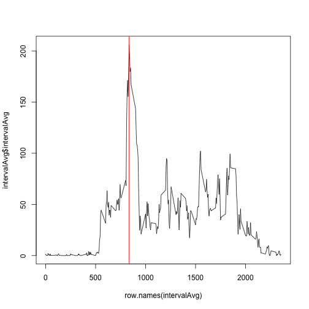
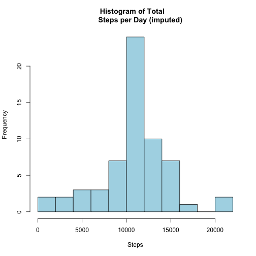
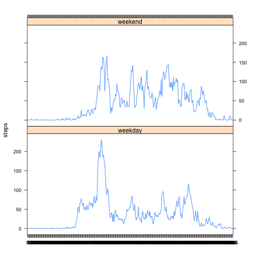

# Reproducible Research: Peer Assessment 1


## Loading and preprocessing the data

Once the file "activity.csv"" is unzipped from https://d396qusza40orc.cloudfront.net/repdata%2Fdata%2Factivity.zip, the data are loaded into R:


```r
        setwd("~/Documents/Coursera/Data_Science_Specialization/R_Working_Directory")
        data <- read.csv("activity.csv")
```

## What is mean total number of steps taken per day?


```r
        #Total up steps of input data by date
        array <- tapply(data$steps, data$date, sum)
        
        #Display histogram of total number of steps taken each day
        hist(array, breaks=10, col = "lightblue", main = "Histogram of Total   
             Steps per Day", xlab = "Steps")
```

 

```r
        #Create array summary and store mean, median, and sum variables
        summary <- summary(array)
        meanSteps <- as.integer(summary["Mean"])
        medianSteps <- as.integer(summary["Median"])
        totalSteps <- sum(array, na.rm=TRUE)
        summary
```

```
##    Min. 1st Qu.  Median    Mean 3rd Qu.    Max.    NA's 
##      41    8840   10800   10800   13300   21200       8
```

The average number of steps taken per day (ignoring NAs) is 10800, and the median is 10800.

## What is the average daily activity pattern?

The following time series plot shows activity patterns from the observed data of average steps for each interval measured throughout the day:


```r
        #Create new dataframe of average steps by interval
        data$interval <- factor(data$interval)
        intervalAvg <- tapply(data$steps, data$interval, mean, na.rm=TRUE)
        intervalAvg <- data.frame(intervalAvg)

        #Make time series plot of steps/day vs interval
        plot(row.names(intervalAvg), intervalAvg$intervalAvg, type= "l")
        abline(v = 835, col="red")
```

 

```r
        intervalAvg <- intervalAvg[order(intervalAvg, decreasing=TRUE),]
        #print(intervalAvg[1])
        #intervalAvg <- data.frame(intervalAvg)
```

The maximum number of steps on average is 206.1698 which takes place on the interval 835, as seen in the graph above.

## Imputing missing values

Imputing the NA values may be done by assuming typical activity of intervals of the other days.  newData include all of these values in lieu of NAs, but are otherwise identical to the original imported data.


```r
#initialize new dataframe as replica of original data
newData <- data

#transform averages back to dataframe to reference for replacement data:
intervalAvg <- data.frame(intervalAvg)

#Replace means into newData if steps measurements are NA
for (i in seq_len(nrow(newData))) {
        if (is.na(newData[i, "steps"])) {
                newData[i, "steps"] <- 
                intervalAvg[row.names(intervalAvg) == newData[i,"interval"],]
                } 
        }
```

The new data with imputed values are summarized with the same code as the original:


```r
        #Total up steps of input data by date
        array <- tapply(newData$steps, newData$date, sum)
        
        #Display histogram of total number of steps taken each day
        hist(array, breaks=10, col = "lightblue", main = "Histogram of Total   
             Steps per Day (imputed)", xlab = "Steps")
```

 

```r
        #Create array summary and store mean, median, and sum variables
        summary <- summary(array)
        meanSteps <- as.integer(summary["Mean"])
        medianSteps <- as.integer(summary["Median"])
        totalSteps <- sum(array, na.rm=TRUE)
        summary
```

```
##    Min. 1st Qu.  Median    Mean 3rd Qu.    Max. 
##      41    9820   10800   10800   12800   21200
```
It's clear that the measures of central tendency have not changed, as the mean and median steps are still 10800 and 10800.  The impact of imputing the missing data have made the model weighted more heavily at the mean, rather than adding data to the extremes and skewing the distribution.  This can be expected since the imputed are "typical data" and basically have just filled in the 8 missing days with measurements associated with average activity level of the subject.

## Are there differences in activity patterns between weekdays and weekends?

Factor data based on weekday or weekend observations and plot average steps in a panel plot based on those factors:


```r
 ##change class to date, assign weekdays
newData$date <- as.Date(newData$date)

#create new factor variable of day type
newData$dayType <- weekdays(newData$date)

require(car)
```

```
## Loading required package: car
```

```r
newData$dayType <- recode(newData$dayType, "c('Monday', 'Tuesday', 'Wednesday'                
                , 'Thursday', 'Friday') = 'weekday';
                c('Saturday', 'Sunday') = 'weekend' ")
newData$dayType <- factor(newData$dayType)
        
#melt and cast
require(reshape2)
```

```
## Loading required package: reshape2
```

```r
newMelt <- melt(newData, id=c("interval", "dayType"), measure.vars="steps" )
newCast <- dcast(newMelt, interval + dayType ~ variable, mean)
        
require(lattice)
```

```
## Loading required package: lattice
```

```r
xyplot(steps ~ interval | dayType, data=newCast, type = "l", layout = c(1,2))
```

 
